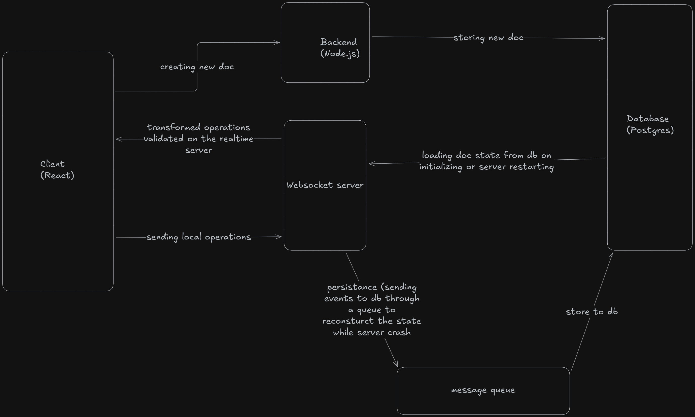

# Realtime Collaborative Editor

A Google Docs–style collaborative editor with custom Operational transform

## Overview

This project is a real-time collaborative editing application built with a Turborepo monorepo architecture, featuring a React client, a Node.js backend, and a dedicated WebSocket server.

The core focus of the system is real-time consistency, achieved through a custom-built Operational Transformation (OT) engine, persistent storage with Prisma, and robust handling of concurrent edits, page reloads, and server restarts.

The architecture and design decisions closely mirror production-grade collaborative systems such as Google Docs and Notion.

## Key Features

- 📝 Real-time collaborative text editing

- 🔄 Custom Operational Transformation (OT) implementation

- 🌐 Dedicated WebSocket server for low-latency sync

- 💾 Persistent document state using Prisma

- 🔁 Page reload & reconnection handling

- 🧠 In-memory + database hybrid consistency model

- 🧩 Monorepo setup using Turborepo

## System architecture

## Operational Transformation (OT)

# Why OT?

To support simultaneous edits from multiple users, the system implements a custom Operational Transformation engine that:

- Transforms incoming operations against concurrent operations

- Preserves user intent

- Guarantees convergence across clients

## OT Highlights

- Versioned document state

- Transformation against unacknowledged ops

- Server-authoritative operation ordering

- Idempotent operation handling

- No-op detection and elimination

## Real-Time Flow

1. Client edits document locally

2. Operation is sent to WebSocket server

3. Server transforms the operation using OT

4. Operation is persisted via Prisma

5. Transformed operation is broadcast to all clients

6. Clients apply the operation deterministically

Persistence & Recovery

- Document snapshots stored in database

- Operation logs persisted incrementally

- Server restart recovers state from DB

- Client reconnect replays missing operations

- Handles:

- page refresh

- temporary disconnects

- WebSocket reconnections

## Tech stack 

### Frontend

- React + TypeScript

- State management for optimistic updates using recoil

- WebSocket client

### Backend 

- Node.js + TypeScript

- REST APIs for auth & document metadata

### WebSocket Server

- Node.js + ws

- Custom OT engine

- Room-based broadcasting

### Database

# Geting started

Install dependies

### npm install

Initialize the Database

### cd packages/database 
### npx prisma init 

### cd ../..

### npx turbo db:migrate
### npx turbo db:generate

Run in dev mode 

### npm run dev